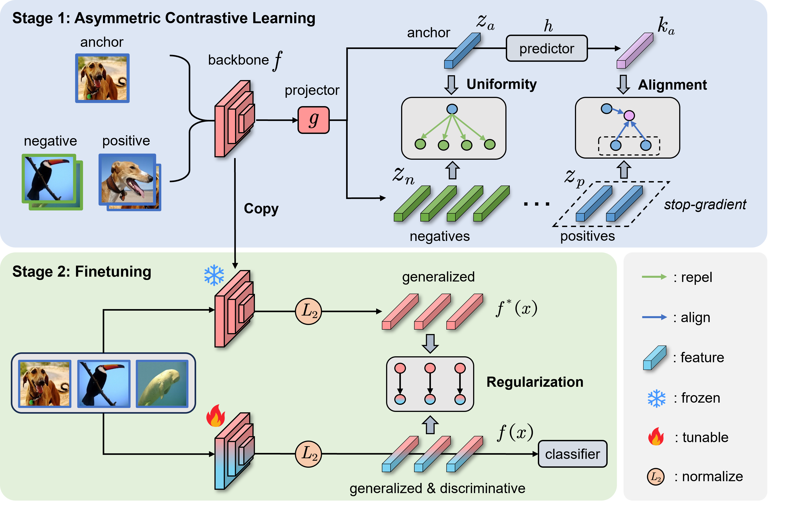

# Few-shot Class Incremental Learning via Asymmetric Supervised Contrastive Learning (AsyCLR)

This repository contains the official implementation of the paper "Few-shot Class Incremental Learning via Asymmetric Supervised Contrastive Learning" (TCSVT2025).




## Enviroment
    pytorch 
    lightly
    tqdm
## Dataset
Refer to other FSCIL repos like CEC, FACT, etc.

Please specify the dataset path in the `configs/base.json`.
## Run
```
# stage 1: Asymmetric Supervised Contrastive learning
python main_AsyCon.py --config configs/mini.yml epoch 500 lamb 0.5

# stage 2: Base-session Finetuning
python main_ft.py --config configs/mini.yml model_path xxx epoch 50 w_dis 2.0
```

## Acknowledgement
This code is based on the following repositories:
- [fscil](https://github.com/xyutao/fscil)
- [CEC](https://github.com/icoz69/CEC-CVPR2021)
- [fact](https://github.com/zhoudw-zdw/CVPR22-Fact)